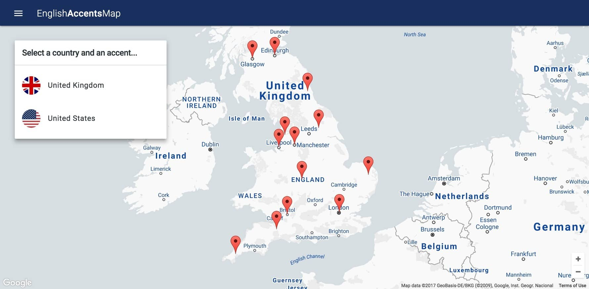
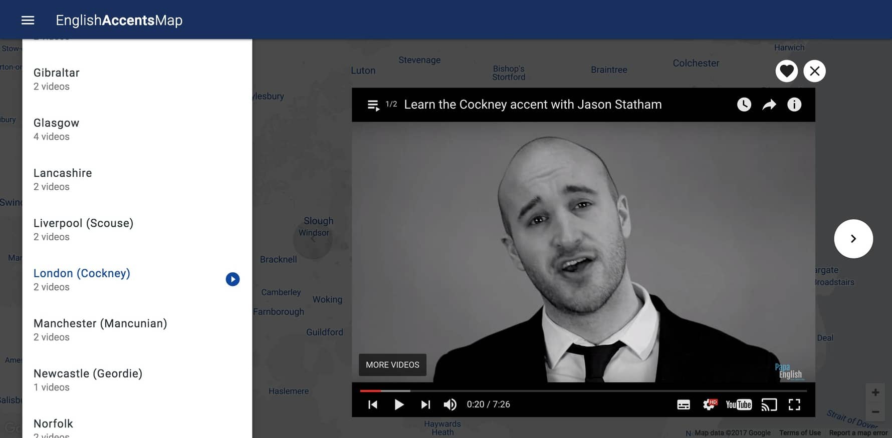

  

# [English Accents Map](https://www.englishaccentsmap.com)

A progressive web app (PWA) built on [React](https://facebook.github.io/react/),
[Redux](http://redux.js.org/) and [Firebase](https://firebase.google.com/).

Watch English accent videos and get an insight into the different ways the language is used by native speakers around the world.

## Prerequisites

In order to run this app locally you will need a [Firebase app](https://firebase.google.com/docs/web/setup)
and a [Google Maps API key](https://developers.google.com/maps/documentation/javascript/get-api-key).

## Installation

1. Clone this repo
1. Run `npm install`
1. Rename `/src/config.example.js` to `/src/config.js` and add your Google Maps API key
and Firebase config
1. Import `/data.example.js` or [this JSON file](https://github.com/ismaelgt/english-accents-db/blob/master/english-accents.json) into your [Firebase database](https://firebase.google.com/docs/database/web/start)
1. Run `npm run start` and visit [localhost:3000](http://localhost:3000)

## Build

1. Run `npm run build`
1. The compiled version will live in `/dist/`

## Deployment

Follow the instructions [here](https://firebase.google.com/docs/hosting/deploying)
to deploy the app to Firebase.

Once the Firebase CLI is installed and your app set up locally you can run
`npm run deploy` to build and deploy.

## License
This project is licensed under the terms of the
[MIT license](https://github.com/ismaelgt/english-accents-map/blob/master/LICENSE).

## See also

- [English Accents CLI](https://github.com/ismaelgt/english-accents-cli) - The command-line interface (CLI).
- [English Accents Database](https://github.com/ismaelgt/english-accents-db) - The JSON database.
